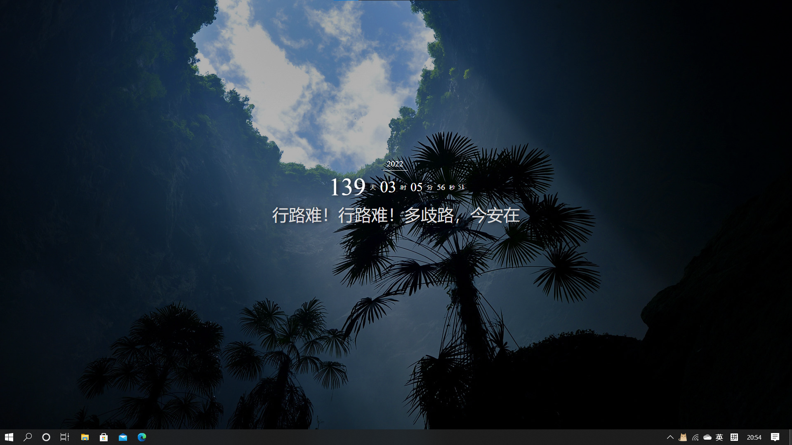
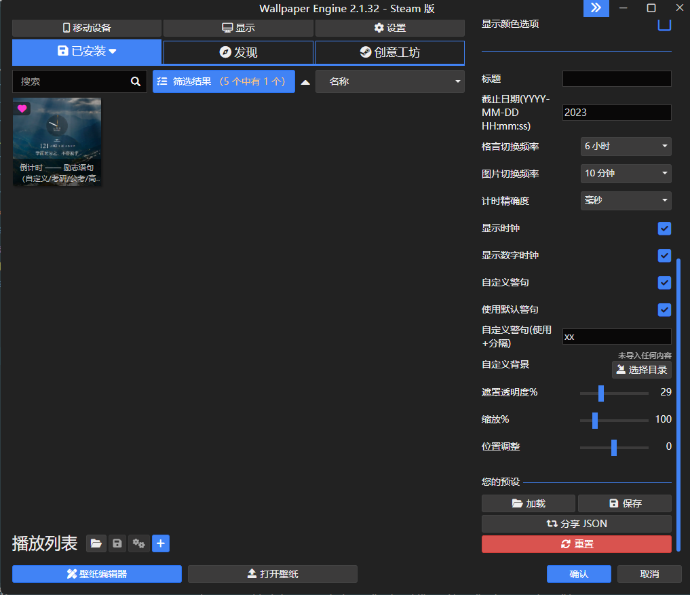

## Wallpaper Engine 倒计时壁纸

访问 [steam 地址](https://steamcommunity.com/sharedfiles/filedetails/?id=2222111958)

### 使用方法

#### 默认配置

1. 默认为当前年份的研究生考试倒计时.

2. 背景图片和警句在一小时内随机切换.

3. 图片大多为必应壁纸，其他用途请注意版权.

4. 警句为励志古诗文名句.

5. 倒计时结束彩蛋.

---

#### 自定义标题和截止日期

- 在壁纸配置项【标题】和【截止日期（YYYY-MM-DD）】中配置即可.

- YYYY-MM-DD 表示推荐的日期格式，例如 2022-01-01.

- 注意！日期的设置默认使用系统时区，如需设置时间，使用 YYYY-MM-DD HH:mm:ss 格式设置更精确的截止时间.

#### 自定义背景图片

- 在配置项【自定义背景】中选择图片文件夹即可.

- 选择自定义背景后，默认壁纸将不再出现在轮播序列中.

- 所选文件夹中无可用图片文件将任使用默认背景.

#### 自定义警句

- 勾选【自定义警句】后出现自定义选项.

- 配置【使用默认警句】选项以选择是否将默认警句加入随机轮播序列.

- 在【自定义警句】中填写自定义的警句，每一句使用“+”（加号）分隔.

- 若自定义警句为空，且未勾选【使用默认警句】，则常显警句“此时无声胜有声”作为提醒.

### 其他

* 有问题和需求可以提 `Issue`，在 steam 上留言我很少看到.

* 点个 star 吗？
  
* ~~最近~~在开发一款 Hexo 的学术风主题，有需要的可以[看下](https://github.com/hooozen/hexo-theme-academic).

* 没了
